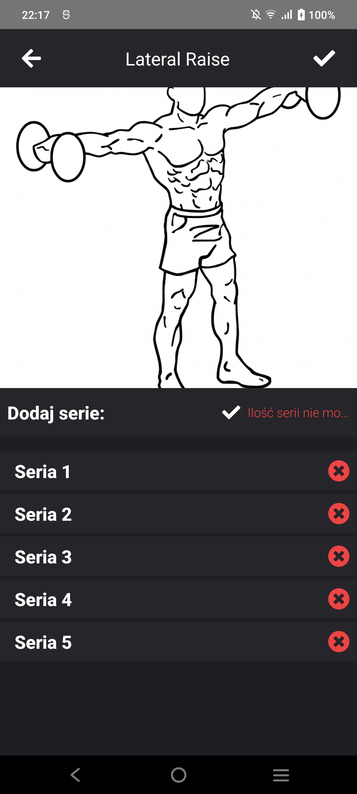
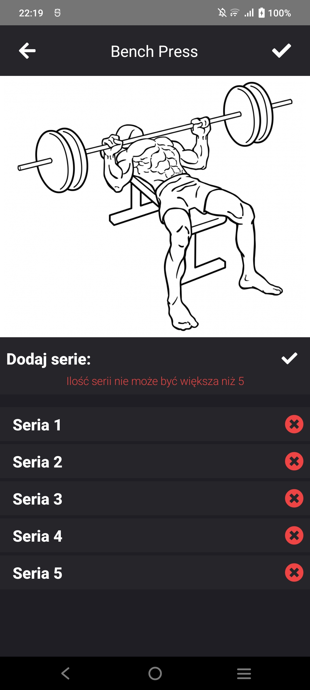

# Obecnie wykryte błędy i rozwiązania

::: danger Problem z wykresami
Ostatecznie jednak prawdopodobnie zrezygnuje z wykresów ze względu na bardzo niskie wsparcie SvelteNative i ubogą dokumentacje
:::

## Ekran konfiguracji i zabezpieczenie przed potencjalnymi błędami

W ekranie konfiguracji użytkownik może wpisać wzrost, imię i wagę. Wiadomo jednak że należy ustawić limit znaków na imię oraz osoba nie może ważyć np. 1kg lub mierzyć 1cm dlatego należy ustawić zakresy.

Tak prezentuje się kod sprawdzający dane:

```ts
const checkBeforeSend = () => {
  let status = true;
  if (personData.name === "" || personData.name.length > 18) {
    errors.nameError = true;
    setTimeout(() => {
      errors.nameError = false;
    }, 2000);
    status = false;
  }
  if (
    personData.weight === "" ||
    Number(personData.weight) > 500 ||
    Number(personData.weight) < 30
  ) {
    errors.weightError = true;
    setTimeout(() => {
      errors.weightError = false;
    }, 2000);
    status = false;
  }
  if (
    personData.height === "" ||
    Number(personData.height) > 300 ||
    Number(personData.height) < 50
  ) {
    errors.heightError = true;
    setTimeout(() => {
      errors.heightError = false;
    }, 2000);
    status = false;
  }

  if (status === false || personData.gender === "") {
    return;
  }

  navigate({ page: Initialization, props: personData });
};
```


## Zabezpieczenie przed cofaniem do ekranu inicjalizacji

Po pierwszej konfiguracji użytkownik może cofnąć się do ekranu inicjalizacji hardwarowym przyciskiem cofnięcia a tego oczywiście nie chcemy dlatego
trzeba wyłączyć hardwarowy przycisk cofania.

Tak prezentuje się fragment odpowiedzialny za to:

```ts
$: {
  if (application.android) {
    application.android.on(
      AndroidApplication.activityBackPressedEvent,
      (data: any) => {
        data.cancel = true;
      }
    );
  }
}

// ----------------------------------------

// włączenie przycisku hardwarowego, niestety na razie jest on bezużyteczny ponieważ po włączeniu tego przycisku następowały bardzo dziwne bugi które na razie nie są priorytetem ze względu na to że każdy komponent ma strzałke do cofania się w tył
const enableHardwareBack = () => {
  if (application.android) {
    application.android.on(
      application.AndroidApplication.activityBackPressedEvent,
      (data: any) => {
        goBack();
      }
    );
  }
};
```

## Konflikt planów o takiej samej nazwie

W przypadku gdy mamy plany o takiej samej nazwię (najprawdobodobniej) mergują się one w bazie danych co jest nie prawidłowym zachowaniem, okazuje się że naprawa błędu jest bardzo prosta a wystarczy w funkcji która dodaje plan w momencie tworzenia nowego dokumentu w bazie usunąć to żeby ID równało się nazwie planu

```ts
const applyPlan = () => {
  const userPlans = new CouchBase("userPlans");
  if (newPlan.cwiczenia.length === 0) {
    userPlans.close();
    return;
  }
  userPlans.createDocument(newPlan, newPlan.name); // usuwamy newPlan.name
  userPlans.close();

  let obj: Cache = {
    name: "Nowy plan",
    cwiczenia: [],
  };

  planCache.set(obj);
  navigate({ page: Plans });
};
```

## Naprawa źle wyświetlającego się tekstu

Serii można dodać tylko 5 gdy próbujemy dodać więcej wyświetla się komunikat niestety w nieprawidłowym miejscu, wystarczy zmienić jego layout.




