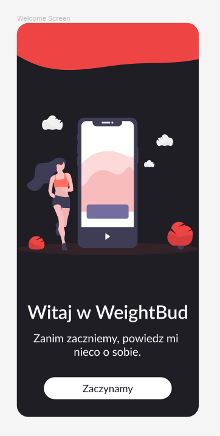
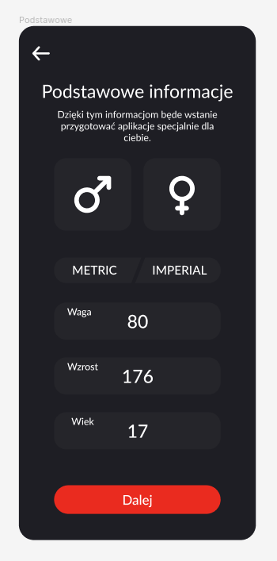
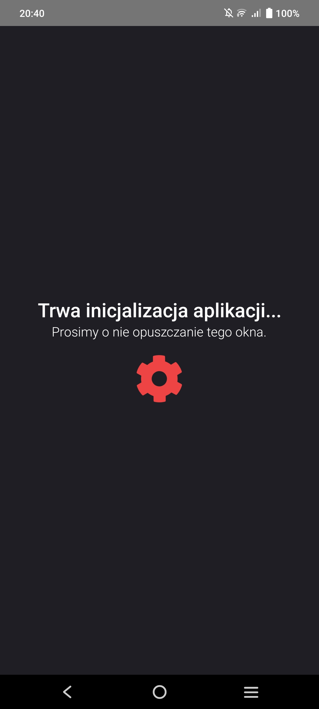

# Wygląd ekranu startowego

::: tip Różnice
Projekty w Figmie będą się zazwyczaj delikatnie różnić od tych utworzonych w developmencie ze względu na np. opinie i porady innych lub ograniczenia językowe.
Gotowe wyglądy można zobaczyć w sekcji odpowiedniego komponentu.
:::

Poniżej zajduje się pierwszy prototyp ekranu startowego oraz konfiguracji danych użytkownika.
Wygląd ten będzie wyskakiwał tylko w przypadku pierwszego uruchomienia i nie skończonej konfiguracji.

## Konfiguracja danych użytkownika

Ekran gdzie użytkownik może podać swoje dane, na ich podstawie będzie można wyliczyć BMI, CMP itp.

## Ekran inicjalizacji

Ekran ładowania gdzie do bazy danych ładowanie są ćwiczenia ze sklepu [Svelte Store](https://svelte.dev/docs#run-time-svelte-store).
Wygląd ekranu inicjalizacji powstał już po projekcie w Figmie.

